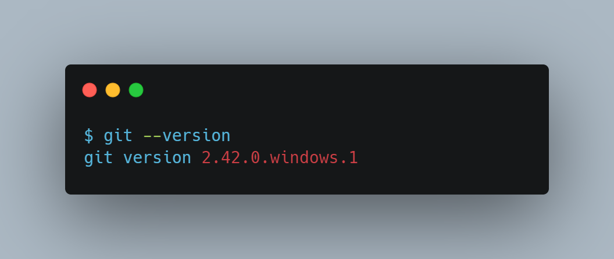
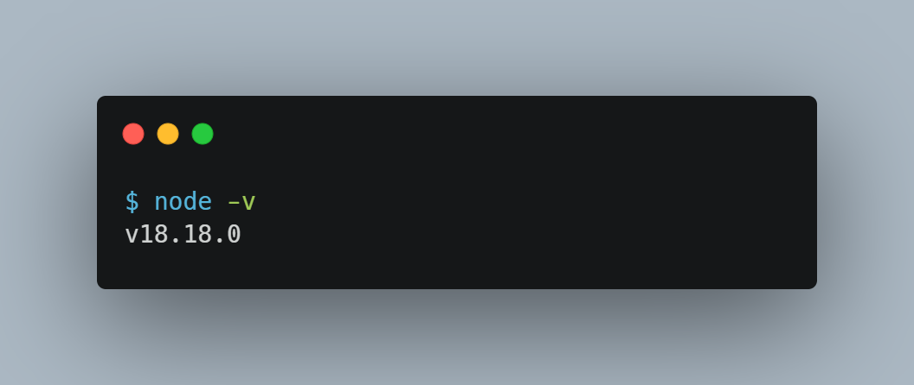

# Build for HTML courses at HTML Academy

The build runs on gulp version 4

## Getting started

To work with the repository on your computer, you will need _Git_ and _Node.js_. Before you start, make sure both programs work. To do this, run the following in the terminal:

- for _Git_

  ```shell
  git --version
  ```

  _Git_ should respond roughly with

  ```shell
  git version 2.42.0.windows.1
  ```

  

  the exact version does not matter. The important thing is that git responded with output

- for _Node.js_

  ```shell
  node -v
  ```

  _Node.js_ should respond roughly with

  ```shell
  v18.18.0
  ```

  

  it is important to have a current LTS version (the first number is even), that is, not lower than 20.9 or not lower than 18.18.

## Installation

1. Clone the repository:

    ```shell
    git clone git@github.com:htmlacademy/html2-basic-template.git
    ```

2. Install project dependencies:

    ```shell
    npm ci
    ```

3. Start working (the browser should launch):

    ```shell
    npm start
    ```

## Folder structure

Each folder has a `README.md` file with a more detailed description of how to work with that folder

```shell
├── .github/                      # Special folder for GitHub
│   └── workflows/                # Automation for GitHub Actions
│       ├── check.yml             # Runs linters on GitHub
│       └── gh-pages.yml          # Publishes the project and creates a project link
├── raw/                          # Folder for raw files (ignored by git)
│   └── images/                   # Folder for original images
│       └── icons/                # Folder for original SVG icons
├── source/                       # Project source files
│   ├── favicons/                 # Folder for favicons (except favicon.ico)
│   ├── fonts/                    # Folder for fonts
│   ├── images/                   # Folder for optimized images
│   │   └── icons/                # Folder for optimized SVG icons converted into a sprite (stack)
│   ├── scripts/                  # Scripts
│   │   └── index.js              # Main script
│   ├── styles/                   # Folder for Sass preprocessor files
│   │   ├── blocks/               # BEM block styles
│   │   │   └── header.scss       # Styles for a specific BEM block
│   │   ├── global                # Files for connecting library styles from the folder
│   │   │   ├── fonts.scss        # Connecting fonts to the project
│   │   │   ├── global.scss       # Global styles that apply to the whole project
│   │   │   └── variables.scss    # Variables for the whole project
│   │   └── styles.scss           # Main stylesheet with imports of all others
│   ├── vendor                    # Folder for third-party libraries
│   └── index.html                # HTML file for the main page
├── .editorconfig                 # Text file formatting settings
├── .eslintrc                     # Rules for eslint
├── .gitignore                    # Git ignore settings
├── .linthtmlrc                   # Rules for linthtml
├── .stylelintrc                  # Rules for stylelint
├── gulpfile.js                   # Gulp automation
├── package.json                  # Project dependencies, scripts, and settings
├── package-lock.json             # Project dependencies
└── README.md                     # Documentation
```

## Main commands

- `npm start` — starts the build with a development server
- `npm run build` — creates the `build` folder with optimized production files

## Additional commands

- `npm run preview` — lets you preview the production build result
- `npm run lint` — runs all checks (takes a long time):
  - `npm run lint:spaces` — checks indentation with editorConfig
  - `npm run lint:markup` — checks HTML markup with the W3C validator
  - `npm run lint:html` — checks markup against linthtml rules
  - `npm run lint:bem` — checks correct BEM usage in markup
  - `npm run lint:styles` — checks the project against stylelint
  - `npm run lint:scripts` — checks scripts against eslint rules
- `npm run optimize` — runs all image optimizations (takes a long time):
  - `npm run optimize:raster` — optimizes raster images from `raw/images/` into `source/images/`
  - `npm run optimize:vector` — optimizes vector images from `raw/images/` into `source/images/`

## Working with markup

Place all HTML markup files in the `source/` folder.

```shell
└── source/
    ├──  index.html
    ├──  catalog.html
    └──  form.html
```

The build copies files from `source/` into the `build/` folder.

```shell
└── build/
    ├──  index.html
    ├──  catalog.html
    └──  form.html
```

## Working with styles

All styles are in the `source/styles/` folder.

```shell
└── source/
    └── styles/
        ├── blocks/
        │   └── header.scss
        ├── global
        │   ├── fonts.scss
        │   ├── global.scss
        │   └── variables.scss
        └── styles.scss
```

Connect all BEM blocks and other preprocessor files in `source/styles/styles.scss`.

```scss
/* GLOBAL */
@import "./global/variables.scss";
@import "./global/global.scss";
@import "./global/fonts.scss";

/* BLOCKS */
@import "./blocks/header.scss";
```

Import BEM blocks in the `/* BLOCKS */` section.

The build processes all preprocessor files and turns them into `styles.css`. The build then copies `styles.css` into

```shell
└── build/
    └── styles/
        └── styles.css
```

## Working with graphics

### Raster

Place all raster graphics at double density from the mockup in `raw/images/`. Graphics here are ignored by git.

After adding graphics, immediately run `npm run optimize:raster` (or simply `npm run optimize`) to optimize the graphics and create `.webp` versions. Run the command once whenever new graphics appear in the project.

New optimized graphics at different densities with density suffixes in file names will appear in `source/images`. Commit this already optimized graphics.

### Vector

Also place content vector graphics (logo, charts, illustrations) in `raw/images/`. Running `npm run optimize:vector` (or simply `npm run optimize`) will place optimized copies of these SVG files in `source/images/`

```shell
└── raw/
    └── images/
```

Place vector graphics for the sprite (icons) in `raw/images/icons/`.

```shell
└── raw/
    └── images/
        └── icons/
```

Running `npm run optimize:vector` will place optimized copies of these SVG files in `source/images/icons/`.

```shell
└── source/
    └── images/
        └── icons/
```

During the build, automation copies all graphics from `source/images/` into `build/images/`, and creates the sprite `build/images/icons/stack.svg` from icons in `source/images/icons/`.

```shell
└── build/
    └── images/
        ├── icons/                # folder for the sprite
        │   └── stack.svg         # sprite
        ├── bg.jpg
        ├── bg.webp
        ├── hero.png
        ├── hero.webp
        └── logo.svg
```

### Favicons

Place PNG and SVG favicon variants in `source/favicons/`.

Place `favicon.ico` and `manifest.webmanifest` in `source/`:

```shell
└── source/
    ├── favicons/
    │   ├── 180.png
    │   ├── 192.png
    │   ├── 512.png
    │   └── icon.svg
    ├── favicon.ico
    └── manifest.webmanifest
```

## Working with fonts

All font files are in `source/fonts/`. The build copies them into `build/fonts/`.

```shell
└── build/
    └── fonts/
        ├──  open-sans.woff2
        └──  open-sans-bold.woff2

```

## Working with scripts

All scripts are in `source/scripts/`.

```shell
└── source/
    └── scripts/
        ├── index.js
        └── modal.js
```

The build copies them into `build/scripts/`.

```shell
└── build/
    └── scripts/
        ├── index.js
        └── modal.js
```

## Working with third-party libraries

To make it easier to add third-party libraries to your project, you can use the `source/vendor/` folder. You can place any files related to external libraries in this folder.

For example, suppose you want to add a library that includes both a stylesheet `library.css` and scripts `library.js`. To integrate them into your project, follow these steps:

Place the library files in the `source/vendor/` folder as shown below:

```shell
└── source/
    └── vendor/
        ├── library.css
        └── library.js
```

If you have several libraries with different files, you can group the files of one library in its own subfolder. For example:

```shell
└── source/
    └── vendor/
        └── library/
            ├── library.css
            └── library.js
```

When your project is built, all files from `source/vendor/` are copied into `build/vendor/` while preserving their structure. For example:

```shell
└── build/
    └── vendor/
        └── library/
            ├── library.css
            └── library.js
```

This way, you can conveniently organize and integrate third-party libraries into your project while keeping their structure in the `source/vendor/` folder.
